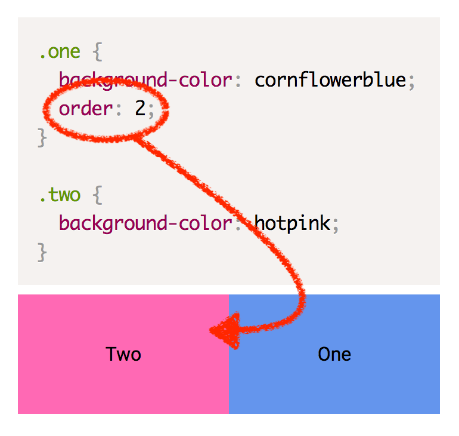
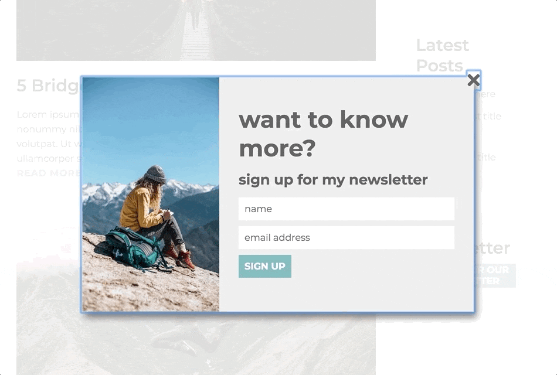

# Keyboard

One assistive technology that we all have available to us is the keyboard. With the keyboard alone anyone should be able to navigate and complete any task available online just as a mouse user would.

For some people, specifically those with a motor impairment who are unable to use a mouse or trackpad, the keyboard is the primary method of navigating the web and interacting with user interfaces.

What's great about the keyboard is the most of us are likely fairly familiar which makes testing with a keyboard alone quite easy.

Let's take a look at a few ways to ensure accessibility for keyboard-only users.

## Focus indicator

One of the most basic aids to help people navigate an app with ease and confidence (and is baked in to every site by default) is the focus indicator.

What is the focus indicator? It's the visual indicator of where you currently are on a page when navigating by keyboard alone.

Load up your favorite site and start pressing the `Tab` key. Is there any indication of where the cursor currently is on the page? If you're in Chrome or Safari the default indicator is a blue outline, where Firefox and Internet Explorer/Edge features a dashed black outline.


For people with **motor disabilities** or any other impairment (temporary or permanent) which prevents use of the mouse, navigating with the keyboard is the next best option.

Additionally, those who consider themselves "power users" who prefer the keyboard over using the mouse, such as filling out long forms, will also greatly benefit.

When you use the `Tab` key on a site, the keyboard cursor will appear, typically a blue ring or black dotted line depending on the browser, and move from one HTML element to the next. Using `Shift` + `Tab` moves the keyboard cursor backward through the page. The elements highlighted are considered to be "naturally" focusable. Elements such as links, buttons, form inputs, etc all receive keyboard focus by default and should highlight when the cursor moves from one to the next.

> If you can't see the cursor on the page, you've got an accessibility issue

Sometimes during the design or development of a project, the request is made to remove the focus indicator ring. This is usually a result of the outline being displayed on mouse interaction which can be viewed as a negative cosmetic result. While it is **strongly** recommended to _not_ remove the default indicator, there are a few work-arounds which could be used as a replacement.

### ✅ [2.4.7 Focus Visible](https://www.w3.org/TR/UNDERSTANDING-WCAG20/navigation-mechanisms-focus-visible.html)

This comes back to WCAG 2.4.7 Focus Visible which states

> "Any keyboard operable user interface has a mode of operation where the keyboard focus indicator is visible.""

### Custom focus indicator

Using CSS it is possible to create your own focus indicator. With a bit of code such as…

```css
*:focus {
  outline: solid 3px red;
}
```

…you can create a custom focus indicator. This places a solid red outline around focusable elements.

When implementing a custom outline, there are a couple things to keep in mind:

- Ensure the contrast ratio of the indicator against the background is high. If people can't see the focus indicator the its purpose is lost.
- Make it consistent. Since a custom focus indicator will be unexpected on first visit, it's a good idea to keep things consistent and predictable throughout the user experience of the site.

### Detect keyboard/mouse usage

There's been lots of great work done recently on detecting when someone's using a mouse or a keyboard to navigate site content. In doing so, designers are able to create a custom, highly visible focus indicator for keyboard users only. Mouse users would be free to rely on only the mouse cursor as their indicator.

This technique is not yet built directly into browsers. However, there are third-party code snippets (also called a "polyfill") available to gain this functionality.

Two of which worth checkout out include:

- [focus-visible](https://github.com/WICG/focus-visible)
- [what-input](https://github.com/ten1seven/what-input)

## Focus order

[](https://codepen.io/svinkle/pen/NBxgbE)

If you're familiar with CSS flexbox or grid, you might know that it's very easy to manipulate the order of content using only CSS. If you need to move a right bar container to the left side of the screen, it's as easy as adding one line of CSS.

The issue here is when someone is using the keyboard, screen reader, or any input that's not a mouse, the focus indicator may jump around the screen unexpectedly. In moving the right bar container to the left via CSS, the HTML used to generate the page content remains in the same position. As a result, the keyboard focus order would move from top header bar to the main content container on the right, then back to the top left of the page, finally to the footer content.

### ✅ [2.4.3: Focus Order](https://www.w3.org/WAI/WCAG21/Understanding/focus-order.html)

> "If a Web page can be navigated sequentially and the navigation sequences affect meaning or operation, focusable components receive focus in an order that preserves meaning and operability."

This comes back to WCAG 2.4.3: Focus Order which states

If a Web page can be navigated sequentially and the navigation sequences affect meaning or operation, focusable components receive focus in an order that preserves meaning and operability.

> Ensure the visual order of content matches the HTML order.

This is an issue when it comes to people with low-vision who rely on zoom software, or someone with a cognitive impairment who may become confused from the unexpected movement from one part of the screen to another. For this reason alone, it's recommended to ensure the visual order of content matches the HTML order the browser interprets on page load. You'll will create a much more comfortable and predictable user experience as a result.

## Focus management



Focus management is a method used to willfully and purposefully move the keyboard cursor from one element to another on behalf of the user. This technique should only be used when absolutely necessary as to not create more work for the user when an unexpected shift in focus has occurred.

An example of default focus management that we get from the browser for free is when we activate the `Tab` key in a form field, focus is automatically sent to the next field in the set. Or, when moving from link to link, focus moves from the top of the document to the bottom. When using native elements, the browser takes care of moving and managing focus position for us.

However, when it comes to creating a non-native control or widget, such as a modal window which we'll look at in greater depth later, we need to manage the focus position on behalf of the user.

How we accomplish this is by use of the `tabindex` attribute.

The `tabindex` attribute can be applied to and HTML element in order to help manage focus, but should be restricted in its use to a few use cases. Let's look at the different values we can assign this attribute and what the intention is behind each.

### `tabindex="-1"`

The value `tabindex="-1"` allows a non-focusable element to programmatically receive focus via JavaScript, but does not add the element to the natural focus order. This means when someone is navigating by the `Tab` key, any element with a `tabindex` value of `-1` will not recieve focus.

For example, when opening a modal window, use JavaScript to apply the `tabindex="-1"` attribute to the container, then call the containers `focus()` method to apply keyboard focus. This allows the user to `Tab` forward from this point.

### `tabindex="0"`

The value `tabindex="0"` allows a non-focusable element to receive focus and includes the element within the natural focus order. With this, when someone is navigating by the `Tab` key, any element with a `tabindex` value of `0` will receive focus.

For example, if there was a need to attach a click event handler to something like a `div` element, applying `tabindex="0"` would allow the `div` to receive keyboard focus when `Tab`bing through page content.

### `tabindex="1"` or higher

Any `tabindex` value greater than `0` is considered an anti-pattern and should be avoided.

For example, if an element featured `tabindex="5"`, this would send focus to this element _first_ when navigating through the page content, then, focus would return to the next element in the natural tab order.

As previously discussed, the browser automatically handles focus management between natively focusable elements. With this in mind, let's rely on the browser to handle focus as determined by the order of element within the document.

### Refrain from adding `tabindex="0"` everywhere!

When it comes to navigating non-focusable elements, such as plain text content, headings, or images, it's important to note that assistive technology, such as screen readers (which will be discussed in more detail later), have built-in functionality to read and consume these types of content pieces.

After learning about using the `Tab` key to move around a UI and the `tabindex` attribute, you may be tempted to place `tabindex="0"` on _everything_ in order to ensure a screen reader user is able to `Tab` to these elements. **Please refrain from doing so.** This is considered an anti-pattern as this will cause more work for keyboard users to move around and consume the content they're interest in.

With some exceptions, only elements to receive the `tabindex="0"` attribute would be those with an action applied, such as a JavaScript click event handler. Leave all other elements out of the natural tab order, otherwise, keyboard-only users would have to hit the `Tab` key many times to reach links at the bottom of a page, cause a very frustrating user experience.

## Exercise!

1.  Load up the HTML pages of our demo site in your browser.
2.  Try navigating with just the `Tab` key.
3.  Fix any issues by adjusting the `website/styles.css` file.
