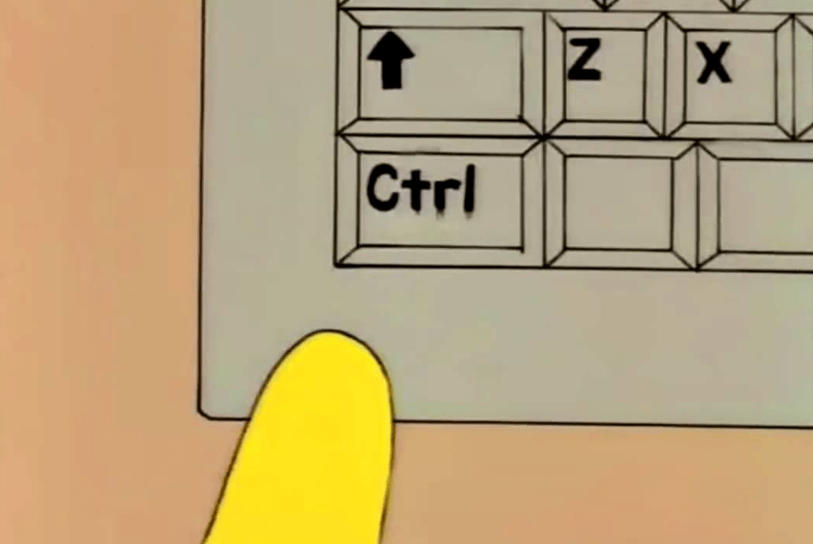

# Testing with screen readers

A screen reader is a piece of software which announces content on the screen. It's one of a few different ways people who are blind interact with the web and technology in general.

So, how do people use the screen reader to read various pieces of content? With the keyboard.

Focus is shifted from one item to the next by using the `Tab` key, which moves the keyboard cursor to each focusable element.

Or, someone can use what's called the virtual cursor which is build into each screen reader.

The method on how to use the virtual cursor depends on the screen reader as each have their own set of keyboard combinations and keystrokes to move around the screen.

> The piece of content which gets announced is the currently focused item.

One thing that that I didn't realize when I first learned about accessibility development was that the piece of content which gets announced is the currently focused item.

For example, if someone were to load a site in their browser, and the first focusable item on the page was a link with the site logo, when they press `Tab` the keyboard focus would move to the link and the screen reader would announce the link presence via it role and accessible name.

Let's look at a few screen reader commands to help us test our user interfaces.

## Common screen reader commands

If you're on an Apple desktop or laptop (or even mobile device), you've got a screen reader called VoiceOver right at your fingertips. If you're using Windows, there's a free, open source screen reader called NVDA available to install.

Let's go over common screen reader commands and methods of navigation in order to test our apps and websites.

### Starting up

**VoiceOver**

Starting up:

- Cmd + F5
- TouchBar: Cmd + Pwr _(x3)_

Shutting down:

- Cmd + F5
- TouchBar: Cmd + Pwr _(x3)_

**NVDA**

Starting up:

- Ctrl + Alt + N
- Windows Run dialog: `nvda`
- Desktop shortcut

Shutting down:

- Windows Run dialog: `nvda -q`
- Taskbar menu

To start VoiceOver (VO), press the `Cmd` + `F5` keys. VO will start reading the page or application you're currently looking at. You can `Cmd` + `F5` again to quit out of VO.

Alternatively if you're on a Macbook with a TouchBar, you'll need to press `Cmd` + `Pwr` three times to start VO.

Start NVDA by pressing `Ctrl` + `Alt` + `N`. Alternatively you can use the Windows Run dialog and enter, "nvda". One method to quit out of NVDA is to use the Run dialog again and enter "nvda -q".

You can also use the desktop icon to start and then use the Taskbar menu to turn NVDA off.

### Pause announcements

Most likely one of the most important keyboard command to know when testing is how to make the screen reader temporarily stop making announcements. This seems to be the only universal truth among screen reader vendors across varying operating systems.

To pause either VO or NVDA (other screen readers, too), simply press the `Ctrl` key.

When you start navigating again, the screen reader voice will come back to life, happily announcing the content that you're currently interacting with.

### `Tab`bing around

- `Tab` to move forward
- `Shift` + `Tab` to move backward

When you have either VO or NVDA enabled, use the `Tab` key to move in a forward direction through interactive elements on the page or `Shift` + `Tab` to move backward.

Depending on your browser settings, by default, elements on the page that you can tab to would be focusable page content; elements such as links, buttons, or form controls. Moving around in this fashion is considered using the "browser cursor." The browser cursor moves focus around from one focusable element to the next.

While this is quite handy for keyboard-only users, there is another cursor which can move to non-focusable items and describes the content on the page with greater detail, the screen reader "virtual cursor."

### Screen reader virtual cursor

**VoiceOver**

- `Ctrl` + `Opt` then `Left` arrow or `Right` arrow

**NVDA**

- `Up` arrow or `Down` arrow

To use the VO virtual cursor, hold down `Ctrl` + `Opt`, then use the `Left` or `Right` arrow keys to move around and have VO announce all types of content on the page.

NVDA's virtual cursor is moved about by using the `Up` and `Down` arrow keys. This reads one line of content at a time.

Reading the page in this manner reveals non-focusable page content, including plain text, image `alt` text, and page headings. This is a great way to test and hear how text content sounds, or if descriptive image `alt` text makes sense with what's being displayed in the image.

## Screen reader + browser combinations

Here are the most common browser + screen reader combinations. These are the most commonly used as they have the best support regarding features and conveying information through native HTML and ARIA.

| Operating system | Browser           | Screen reader |
| ---------------- | ----------------- | ------------- |
| Windows          | Internet Explorer | JAWS          |
| Windows          | Firefox           | NVDA          |
| Windows          | Firefox           | JAWS          |
| macOS            | Safari            | VoiceOver     |
| iOS              | Safari            | VoiceOver     |
| Android          | Chrome            | TalkBack      |

For more details, see the [Screen Reader User Survey](https://webaim.org/projects/screenreadersurvey7/).

## Exercise!

1.  Load up the homepage of our demo site.
2.  Set your system volume to low — just enough so you can hear it.
3.  Start up your screen reader, then shut it off.
4.  Start the screen reader, hit Ctrl to pause.
5.  Try pressing `Tab` around — how do things sound?
6.  Try your screen reader virtual cursor!
