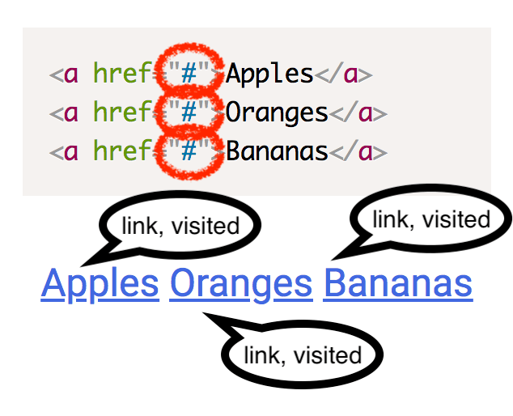
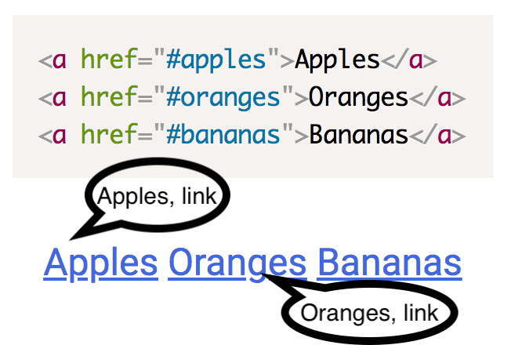

# Links vs Buttons

A link has very different semantic meaning than a button element. When to use one or the other has been discussed and argued by many an accessibility developer. Much like the old debate of spaces vs tabs in code editors, people have their opinions. What it really comes down to is the context of which the control is being used.

Let's go over the basics in which people tend to agree on:

## Link and button expectations

| Element | Is announced as | Is activated by    | Results in                                                                        | `Shift`s focus? |
| ------- | --------------- | ------------------ | --------------------------------------------------------------------------------- | --------------- |
| a       | _"link"_        | `Enter`            | Loading a new page, downloading a file, or jumping to a section on the same page. | Yes             |
| button  | _"button"_      | `Enter` or `Space` | Submitting a form or executing an on-screen action (eg., sorting table columns.)  | No              |

From this table, we're able to recognize how each of these elements are announced, how someone would interact with them, and the expected result. This, in an essence, is what "semantic HTML" is all about.

One key difference to recognize is the expectation of a shift in focus. Links typically either load a brand new page, resulting in a focus shift to the top of the document, or jump to somewhere else on the same page resulting in keyboard focus moving to that position.

On the other hand, buttons do not shift focus. If a button is in use, the expectation would be for keyboard focus to remain on the button even after activation.

## Control design

What is actually meant by, "control design?" This is referring to the look and feel of the focusable elements; in this case links and `button`s.

In modern web design, it's not uncommon to see links which look like `button`s; text with a background color and rounded borders, or a solid outline and transparent background. It's slightly less common to see `button`s which look like links, but it does happen.

### Control design and accessibility


When it comes to accessibility best practices, the ideal design for each control would be something of a traditional look; colored text with an underline to denote a link and a solid background color with slightly rounded corners to denote a `button`.

Why is it so critical to usability and accessibility for these elements to appear in this manner? Here's a few reasons:

- Having controls designed in a consistent manner allows people with a **cognitive impairment** to identify and use the control with confidence, that it will result in meeting their expectations.
- When someone with a **motor disability** relies on voice dictation software and they announce, _"click Submit button"_ when really the `button` is actually a link element, their command will not work.
- When links are only distinguished by color alone, folks with **color blindness** or **low-vision** may not be able to perceive the link for a link and miss it completely.

With links designed like links and `button`s designed like `button`s, everyone will benefit from the clear indication of which is which and will be able to use the controls with confidence. The idea is to avoid activating something that they weren't expecting, causing them more work to undo the previous action.

In other words, make sure things are clear, consistent, and obvious.

## Hover, focus, and active state

Another consideration when designing interface controls; the hover, focus, and active state.

### Hover state


```css
a:hover {
  color: FireBrick;
}
```

The hover state comes into play when someone using a mouse hovers over an interactive element. Changing the visual aspect to something like a background color or an underline greatly helps to generate a visual cue that the element they're currently hovering on is interactive. It provides a sense of reassurance that this thing they're currently hovering over is indeed clickable.

### Focus state


```css
a:hover,
a:focus {
  color: FireBrick;
}
```

Likewise, when someone is using a keyboard to navigate through a page, the focus state should be made available to alter the visual aspect in order to denote the current position of the keyboard cursor on the page.

It's generally best practice to include focus visuals along side hover styling in order to provide a consistent visual treatment.

### Active state


```css
a:active {
  color: Black;
}
```

In addition to the hover and focus state, the active state is also available.

The active state shows only when an element is currently being interacted with. For example, when someone clicks down on a link and then releases the mouse button, that in-between state is the active state.

Including a unique active state style helps people with **motor impairments** or even **dyslexia** as when an item is interacted with, the active state serves as a confirmation and reassurance that the element was clicked.

## Notes on the `href` attribute

Sometimes when creating a web app it's common to add a click event to a link element. Weather it should be an `a` is unknown without understanding the context of the task at hand. What is important, though, is that the link is always accompanied by its `href` attribute.

### The missing `href`

**Don't do this:**

```html
<a onclick="doSomething()">Do something</a>
```

**Do this instead:**

```html
<a href="#doSomething" onclick="doSomething()">Do something</a>
```

What happens when the `href` attribute is missing? The mouse click event works just fine, however without the `href` attribute, the link is no longer keyboard focusable.

This is an issue for keyboard-only and screen reader users as they'd have no way to access the control. At this point, the element is essentially a fancy looking `span` with no semantic meaning.

**Always include the `href` attribute.**

### Including a unique `href` value



Just like how links have a visual unvisited and visited state (by default, blue links which turn purple post activation), screen readers also announce
the visited state.

Coming back to the web app example of using a link elements with a click event handler, it's common to include the `href` attribute with the number or "hash tag" character (`#`). With the number character set as the `href` destination, focus would be brought back to the top of the document on click. However, with the custom JavaScript event attached, we don't need to really worry about the destination, right?

The problem here is that since the link (or potentially many links on the same page) feature the same `href` value, activating one will set all the others in the "visited" state. For someone using a screen reader, hearing "link, visited" when they in fact hadn't yet visited the link can be a confusing experience.



The solution here is to always include a unique string along with the hash character in the `href` value. This could be set to the `id` of the element which the link interacts with when it shifts keyboard focus, or a randomly generated string. The point is to only set a link as "visited" after it has actually been interacted with.

## ✅ [2.4.4 Link Purpose](https://www.w3.org/WAI/WCAG21/Understanding/link-purpose-in-context.html)

This comes back to 2.4.4 Link Purpose which states

> "The purpose of each link can be determined from the link text alone or from the link text together with its programmatically determined link context.""
