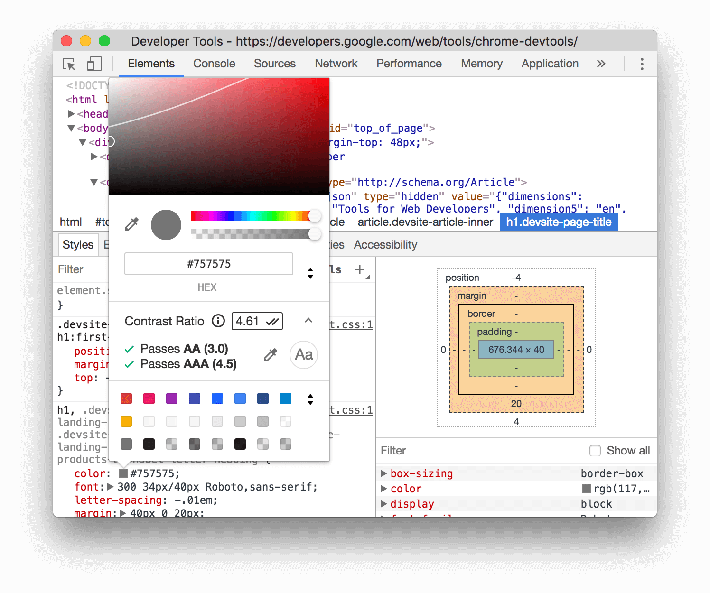

# Color contrast

**Contrast** is the difference in luminance or colour that makes an object (or its representation in an image or display) distinguishable.

In other words, how readable is text against its background? If the contrast is low, people will have greater difficulty with reading the text. On the other hand, a higher contrast will allow for easy reading.

In regards to web accessibility, color contrast is the #1 offender on the web when it comes to accessibility issues. For example, colors like grey on black, light grey on white, etc. These color combinations, as well as a host of others, can be very difficult for some people to perceive.

In order to be more inclusive with our color choices, let's look at how we can test our colors to make sure they're actually readable.

## Contrast threshold

When it comes to choosing which colors to use for a design, there is a specific number, or contrast ratio, to reach for. This threshold has been determined by the W3C as a way to ensure people with **low-vision** are able to read text content.

The threshold breakdown is as follows:

| Object                         | Ratio |
| ------------------------------ | ----- |
| Text and images of text        | 4.5:1 |
| Large text (greater than 18pt) | 3.0:1 |
| Non-text (borders, icons)      | 3.0:1 |

As displayed here, the threshold is more forgiving for larger text and non-text content, such as `input` borders and icons. However, we still need to ensure these elements are also highly visible.

Now that we know what to watch for and which ratios should be used to test which type of content, how do we actually test the contrast ratio of our colors to ensure readability?

## Contrast tools

We have available to us quite a number of color contrast testing tools. Some are more automated than others; which one you use might depend on your current need.

Here's a few contrast ratio tools to consider:

- [Snook's Color Contrast Checker](https://snook.ca/technical/colour_contrast/colour.html) is a great tool for testing the contrast ratio, includes lots of other details and tools
- [Lea Verou's Contrast Ratio](http://contrast-ratio.com/) calculator has a nice and simple UI to test color contrast
- [Chrome Dev Tools](https://developers.google.com/web/updates/2018/01/devtools#contrast) now has color contrast tests built-in to its dev tools
- [Lighthouse](https://developers.google.com/web/tools/lighthouse/#devtools) is another set of tools built in to Chrome which includes automated accessibility testing, including color contrast tests

## Don't rely on color alone

When it comes to relaying messages to the user, especially something important such as an error or success state of a form, how much time is left to complete an exercise, or sections of a pie chart, it's best to not rely on color alone to convey this information. People with **low vision** or **color blindness** may not notice and miss seeing this information.

There are different types of **color blindness** and **low-vision** impairments which makes seeing specific colors difficult or impossible. With this in mind, to help convey this important information, it's ideal to include other visual indicators such as:

- An icon along side error text
- An underline for links embedded within body text
- Textures or patterns to differentiate sections of a graph or chart

With these extra visual affordances, people with color blindness, low-vision, or perhaps even a cognitive disability will have greater success in using and completing various tasks on your site or app.

## ✅ [1.4.3 Contrast (Minimum)](https://www.w3.org/TR/UNDERSTANDING-WCAG20/visual-audio-contrast-contrast.html)

This comes back to 1.4.3 Contrast (Minimum) which states

> "The visual presentation of text and images of text has a contrast ratio of at least 4.5:1.""

## Exercise!

Now that we have a few tools at our disposal, let's try it out! Open the demo site and try to test some of its colors with using the Chrome contrast tool.

1.  Load up the HTML pages of our demo site in your browser.
2.  Right click an element on the page which you _suspect_ may have poor color contrast
3.  Click **Inspect**
4.  In the **Styles tab**, find the color property and click the color swatch
5.  Review the color contrast ratio value
6.  Use the color picker to move the cursor **below** the white line in order to select an accessible color
