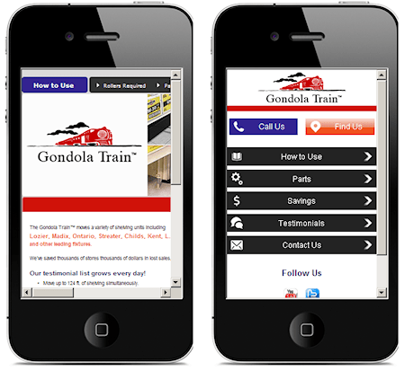

# Responsive design

The term "responsive web design" was first coined way back in 2010. The basic concept is to use CSS to shape and mould the layout of your site in order to output your content in a way which fits the restraints of the networked device currently in use. In other words; one design to be used on any device.

Responsive design is great laying out content for a variety of screens, but how does it come into play for accessibility? Let's discuss a few tips on making sure your responsive design also aids those users who rely on assistive technology.

## Avoid 2D scrolling



In the past, if someone with low-vision needed to zoom their browser window in order to better read content, traditionally this would result in the poor experience of 2D scrolling; having to scroll horizontally as well as vertically in order to consume the content. 2D scrolling is not only an irritant for most people, it also introduces a new level of difficulty for anyone with a motor impairment or someone who relies on the keyboard alone to navigate; this requires a shift from using the `Tab`/`Space` key to read content vertically, to the arrow keys to read horizontally, and back again.

Where responsive design plays its role is now when someone zooms their browser to enlarge the content, the layout and styling rules defined within the CSS media queries will load as the zoom level increases. In other words, when content is zoomed the person on the other side of the screen will experience the "mobile" layout eliminating the need for horizontal scrolling, resulting in a much more positive user experience.

### The viewport meta tag

This is due to the inclusion of the viewport meta tag:

```html
<meta name="viewport" content="width=device-width, initial-scale=1" />
```

Found in the `head` section of a website, this `meta` tag tells the browser to set the width of the content to the width of the device itself, and to scale that content on load.

If the site layout has been developed with responsive design best practices, this would be enough to remove any 2D scrolling in order to comfortable consume the content.

### ✅ [1.4.10 Reflow](https://www.w3.org/WAI/WCAG21/Understanding/reflow.html)

This comes back to 1.4.10 Reflow Characteristics which states

> "Content can be presented without loss of information or functionality, and without requiring scrolling in two dimensions."

## Touch targets

How many of us have been in the situation where we try to touch/click an element on our phones but it's just too small! Or worse yet, we accidentally tap on something else we didn't mean to click on, resulting in having to find the back button on the mobile browser to try again. Frustrating, right?

Specifically what we're talking about here are UI components such as hamburger menu controls, social media icons, form `input`s; basically anything that's a stand-alone element on a page., ie, not a an embedded link within body content.

### Touch target size

When it comes to ensuring usability and accessibility concerns of touch target size, there are a few thing to keep in mind, including the available size of the element and space in between elements in order to avoid accidentally activating something unintended. Here are a few rules to consider from other organizations:

- [Google's Web Fundamentals](https://developers.google.com/web/fundamentals/accessibility/accessible-styles) guide recommends a touch target size of **48x48 pixels** with at least **8 pixels** in between.
- [Apple's Human Interface Guidelines](https://developer.apple.com/design/human-interface-guidelines/ios/visual-design/adaptivity-and-layout/) recommends at touch target size of at least **44x44 pixels**.
- [Web Content Accessibility Guidelines](https://www.w3.org/TR/WCAG21/#target-size) v2.1 also includes the recommendation of a touch target size of 44x44 pixels.

What's important to note here is when it comes to design, making the actual icon larger to satisfy these recommendations isn't required. By using the CSS `padding` property we can make the touch area larger without affecting the design or layout of the content.

### Touch target example

- [Touch targets…](https://codepen.io/svinkle/pen/eKxJWK)

In the following example, trying adding padding to the link instead of margin. This keeps the same layout yet makes the actual touch portion of the link larger.

### ✅ [2.5.5 Target Size](https://www.w3.org/WAI/WCAG21/Understanding/target-size.html)

This comes back to 2.5.5 Target Size which states

> "The size of the target for pointer inputs is at least 44 by 44 CSS pixels."

## Whitespace

Using white space, which is the blank, empty area in between interactive components, is actually quite critical when designing and creating _usable_ user interfaces.

For example, it's not too uncommon to come across a group of links which are meant to behave as callout actions. Often these will be made up of three or more links in a grid and may feature no whitespace in between. This might provide a certain aesthetic appeal, however when it comes to someone with a **motor impairment**, such as hand tremors where they're unable to control the movements of their own hands, the usability of navigating past these callout links becomes problematic.

Let's checkout the following video for an example:

- [Hand tremor, scrolling accessibility problems](https://youtu.be/BE5WRtWPmAw)

As we've witnessed in this video, the person was having great difficulty when trying to navigate past these large touch target and repeatedly activated the links by accident. This is why it's ideal to place at least 8-10 pixels of whitespace in between interactive elements. Without this white space, it can result in a frustrating user experience.
