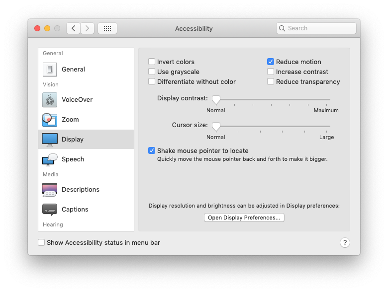
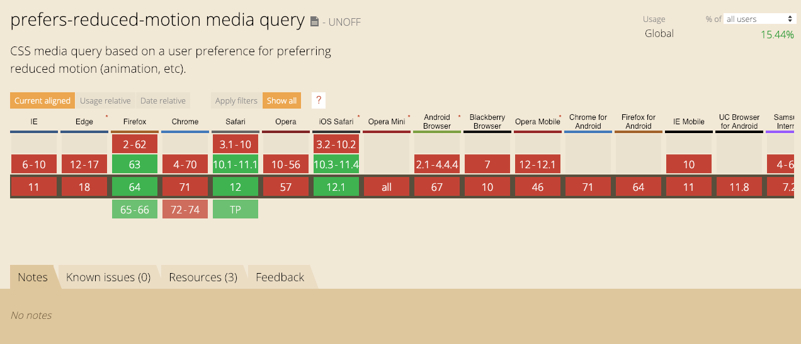

# Animation

Have you ever had a bad day where you're just not feeling great? Perhaps you have a headache, or feeling nauseated from the night before? Then you go online to be greeted with a bunch of animation, scroll jacking, parallax motion, or a video background on a slide that it only make you feel worse! It happens to us all at some point or another.

Using animation on the web is a great way to bring a unique flare to your design and maybe add a bit of delight to your user experience. Well designed animations are informative; they let the user know something has taken place or are used to guide the user to a new task which needs attention. Ideally, animations would be useful, predictable, and consistent.

On the other hand, poor use of animations might be distracting, take the attention away from the current task, and might even leave someone feeling queasy and disoriented.

## What actually makes up a "poor" animation

Everyone will have a different reaction, or perhaps no reaction at all, to a piece of animation. For those who do experience a negative reaction, how to we avoid creating such an experience?

Here's a few points to consider when creating animations:

- **Size of movement.** Small or compact animations, like a loading spinner, are helpful. However, if there's something moving from one side of the screen to another, especially critical pieces of content, this can be problematic. Keep animations small and purposeful.
- **Direction and speed.** Parallax effects and scroll jacking, which tend to involve foreground and background elements moving at different speeds, or objects moving in different directions than expected, can cause issues. Allow the user to scroll at their own pace.
- **Distance.** For animations which seem to span large lengths of space, although only the size of a computer screen, can sometimes trigger a negative experience. Again, it's best to keep animations small and compact in order to avoid a negative user experience. Refrain from animating long lengths of content.

Animation is something that can unexpected, and when it's there, we typically don't have a whole lot of control over the experience. How can we ensure when animation is in use that we also create an accessible experience?

## Animation and accessibility


How might adding animations to a website, app, or even an operating system, have a negative impact on those with a disability? Here's a couple ways:

- When it comes to someone with a **cognitive impairment**, setting in place a highly animated scene or activity upon completing an action, or having other moving pieces on the screen such as an auto-playing video or advertisement can be very distracting.
- For folks who are susceptible to motion sickness or **Vestibular issues**, some animation can very easily lead to feelings of nausea or vertigo.

## Animation example

Before we move on to discuss methods of ensuring a positive user experience with animation, let's _briefly_ look at a few examples…

- [Split Landing Page](https://codepen.io/2975/pen/WdMMaR)
- [Vimeo Cameo](https://vimeo.com/cameo)
- [Bolden](https://www.bolden.nl/)
- [Tank Design](https://tankdesign.com/)
- [The Boat](http://www.sbs.com.au/theboat/)

I think there's no doubt that there was a lot of effort and creativity put into making each of these sites. However, we might be able to conclude that inclusivity was not in mind when these user experiences were designed. Each example includes elements which would be problematic for some people with disabilities.

## The `prefers-reduced-motion` media query

One tool in the developer toolbox we can utilize is the `prefers-reduced-motion` CSS media query. In order give the choice of experiencing animations for our users, both macOS and iOS feature a setting to remove animation altogether called Reduce motion. When this setting is enabled within the operating system settings, code within the `prefers-reduced-motion` media query will fire, allowing developers to essentially create a "no animation" state.

### Setting the OS

First, let's review how to enable this Reduce motion setting in macOS:



1. macOS Settings
2. Accessibility
3. Display
4. Activate the **Reduce motion** checkbox

With this set, any code within the `prefers-reduced-motion` media query will execute.

### Coding a "no animation" state

When we want to remove or disable a piece of animation in a website, we can add the CSS to a `prefers-reduced-motion` media query.

For example, if there was a `transition` set on all `a` elements to animate the color on `hover` and `focus`, the CSS might look like:

```css
a {
  color: Crimson;
  transition: color .25s;
}

a:focus,
a:hover {
  color: FireBrick;
}
```

And if, for example, the end user didn't want to wait the `.25` seconds for the transition to complete for some reason, we could provide a "no animation" state by utilizing the `prefers-reduced-motion` media query:

```css
@media (prefers-reduced-motion) {
  a {
    transition: none;
  }
}
```

And that's it! By including this bit of CSS, any `transition` animations set on the `a` selector will be removed when the user has selected the Reduce motion option in their operating system settings.

### Browser/OS Support



As of this writing only Safari and Firefox support this media query with other browsers and operating systems trailing behind. However, let's not let this prevent us from future-proofing our code. People in the future who require and rely on this setting will thank you.

By using the `prefers-reduced-motion` media query, we're allowing our users to remove all animations which they may find distracting or jarring. Remember, the key here is to provide a usable and comfortable user experience in order for people to enjoy, return to, and share the content we create.

## ✅ [2.3.3 Animation from Interactions](https://www.w3.org/WAI/WCAG21/Understanding/animation-from-interactions.html)

This comes back to 2.3.3 Animation from Interactions which states

> "Motion animation triggered by interaction can be disabled, unless the animation is essential to the functionality or the information being conveyed."

## Exercise!

1. In your browser, load: `demo-site/blog-post.html` and
  - Mouse-over the "Leave a Comment"
  - Click the "Newsletter" link
2. In your editor of choice, load: `demo-site/css/styles.css`.
3. Add the `prefers-reduced-motion` media query to disable the fade-in animations.
