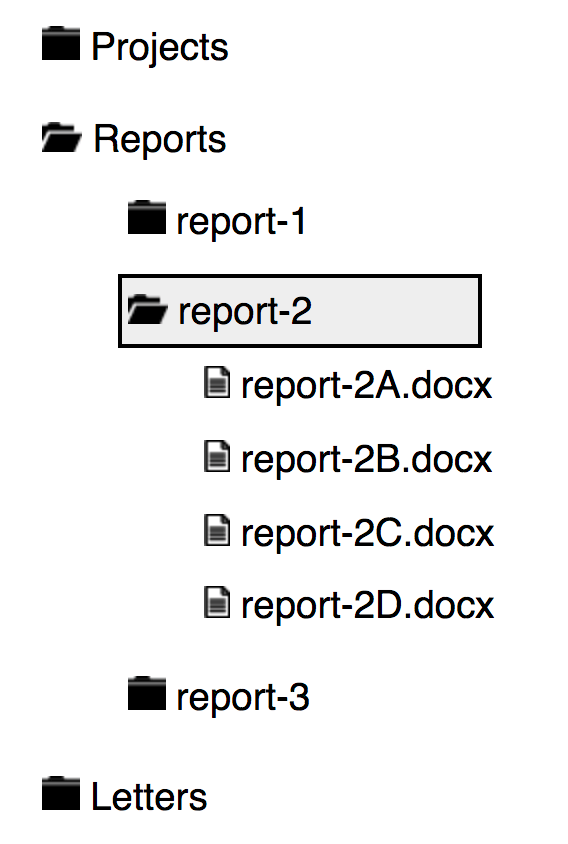
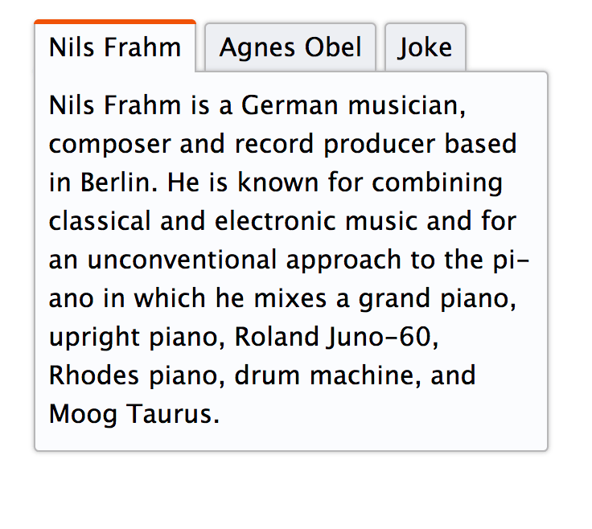
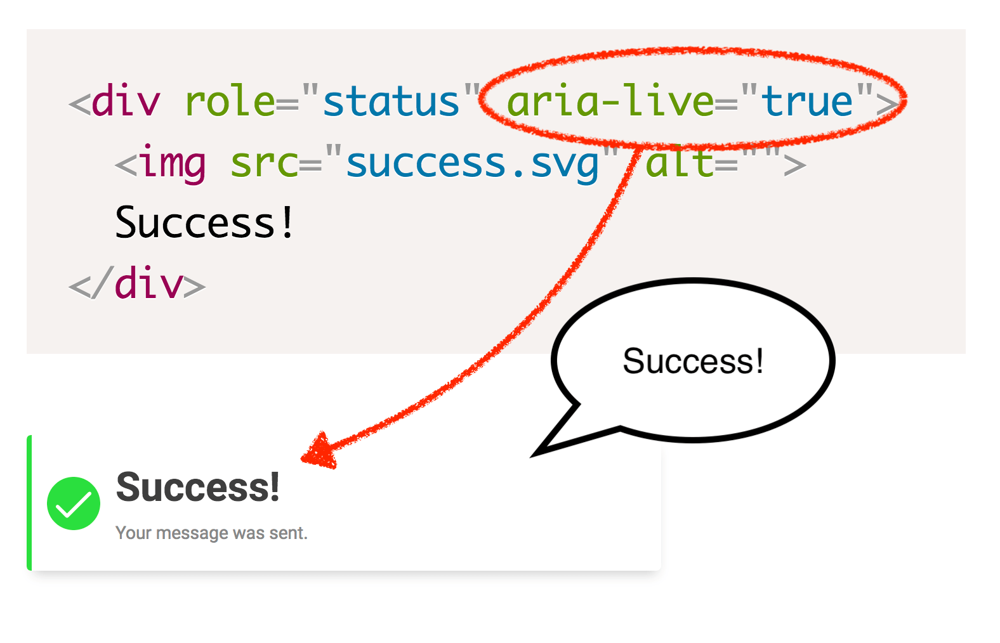

# ARIA

ARIA stands for Accessible Rich Internet Applications.

Its purpose is to allow for web application developers to create accessible, custom user interfaces using non-native HTML elements. Assistive technologies are able to read the properties, roles, and states of custom components and convey their meaning in a way which people with disabilities are able to understand and interact with.

In other words, ARIA acts as a bridge between non-native HTML elements and assistive technologies by generating semantic meaning for custom components. ARIA helps to answer the question of, "What is this thing and what does it do?"

## How does ARIA accomplish this?

ARIA is essentially a set of specific HTML attributes which get applied to various elements. For example, when a screen reader user comes in contact with an element featuring one or many of these attributes, the screen reader software will recognize the supplied attributes and their values and announce this information out loud.

Let's take a peek at a few of the attributes available.

| Attribute       | Purpose                                                       | Example                                                                   |
| --------------- | ------------------------------------------------------------- | ------------------------------------------------------------------------- |
| `role`          | Used to add or alter the base semantic meaning of an element. | `<div role="button"></div>`                                               |
| `aria-label`    | Adds an accessible name to an element.                        | `<div role="button" aria-label="Fake button"></div>`                      |
| `aria-disabled` | Announces the element as in a "disabled" state.               | `<div role="button" aria-label="Fake button" aria-disabled="true"></div>` |

## What ARIA does _not_ do

It's important to note what ARIA does (above) and what it doesn't do.

1. When you apply ARIA attributes, roles, and state properties to an HTML element, this does not automatically allow the element to be keyboard focusable.

2. ARIA also does not add all the expected keyboard interactivity. These are things that you, as the developer, need to implement yourself. For example, with the "fake button" on the previous slide and all the attributes that were added, this would announce the element as a "button", but this will not make the `div` focusable nor will it provide the expected keyboard interaction via `Enter` or `Space` keys. Again, these are things you need to add yourself.

## Custom components

As previously mentioned, one thing ARIA is capable of is adding semantic meaning to custom components. Let's look at how to create a checkbox using native HTML then again using ARIA.

### Checkbox in HTML

The HTML checkbox will need to have:

1.  A `label` element explaining its purpose
2.  The `input` element along with appropriate attributes to convey what it is
3.  A clearly defined state. In the case of a checkbox, the state would either be, "checked" or "unchecked"

Typical HTML for a checkbox would look like this…

```html
<label for="apple-checkbox">
  <input type="checkbox" id="apple-checkbox" name="apple" /> Apple
</label>
```

When someone `Tab`s to this checkbox, a screen reader would announce, _"Apple, checkbox, not checked."_ In doing so, the user would know they're currently focused on a checkbox element, its label is "Apple," and the current state is not checked.

The user could either interact with the checkbox (by pressing the `Space` key) or move on.

### Checkbox built with ARIA

Now, let's re-create the same checkbox using div elements and ARIA attributes.

The checkbox will need to have:

1.  An accessible name explaining its purpose
2.  A role to convey what it is
3.  A clearly defined state, checked or unchecked

Let's look at the HTML code to accomplish this…

```html
<div class="checkbox__wrapper">
  <div
    class="checkbox__checkbox"
    role="checkbox"
    tabindex="0"
    aria-checked="false"
    aria-labelledby="apple-checkbox"
  ></div>
  <div class="checkbox__label" id="apple-checkbox">Apple</div>
</div>
```

1. The `div` with `class="checkbox__checkbox"` would represent the checkbox visual, typically with an SVG icon or CSS
2. This `div` also features `role="checkbox"`. This is the attribute required for screen readers to announce this component as a _"checkbox."_ Without it, it would appear as a generic container.
3. The div features the `tabindex` attribute with its value set to `0`. This allows non focusable elements to receive keyboard focus when the user `Tab`s to the element.
4. The `aria-checked` attribute is present which conveys the current state of the checkbox. When interacted with, this value would need to toggle from false to true.
5. Finally, the `div` has the `aria-labelledby` attribute with its value set to the `id` of the element which holds the text label. When this `div` receives keyboard focus, the `aria-labelledby` attribute will make the connection with the element which matches its value and add the matching element's content to the announcement of the checkbox on focus.

As you may be able to tell, using the ARIA method is quite a bit more code to write and maintain. This is only the HTML needed to create the ARIA version of a checkbox. There's also the CSS code to visually style the checkbox as well as the JavaScript to handle the `Space` keypress event and toggle the `aria-checked` value.

For this reason, it's recommended to use native HTML elements. This way there's less code to write and maintain, as well as the built-in keyboard support and semantic meaning that comes with each native element.

### Non-standard components





ARIA can also be used to create common "desktop" interface patterns that are non-native on the web or in the browser. These patterns are well documented on their implementation and expected interactions in the WAI-ARIA Authoring Practices guide.

For example, complex desktop applications may feature a tree view or a tab interface as a means to navigate the content within the app. There is no "tree" or "tab" element available within HTML. Therefore, if your web app design calls for such a component, one can be created and implemented using a combination of HTML and ARIA to convey the meaning and purpose of the pattern, and then add CSS and JavaScript to apply the necessary styling and functionality.

### Live region components



One other unique feature that ARIA adds is the ability to create a live region. With a live region, you're able to send an audible message out to screen reader users, when appropriate, in order to inform them of a change in state upon interaction or a timed message.

For example:

- When sending or deleting an email from a list, it would be ideal to let the user know when the message was either sent or removed from their inbox
- When adding an item to a cart, make the user aware of the successful addition
- If someone has a limited amount of time to complete a task, announce the amount of time remaining in semi-regular intervals
- If an app is currently in a loading state displaying a loading animation, make screen reader users aware of this context as well

The purpose of a live region is to help provide an equal user experience for those who are unable to see the user interfaces we create and make sure they're made aware of the current context.

> Refer to the [WAI-ARIA 1.1](https://www.w3.org/TR/wai-aria-1.1/) spec document for more information.

This is just a fraction of what ARIA is and what it can do. Please checkout the [WAI-ARIA 1.1](https://www.w3.org/TR/wai-aria-1.1/) spec document for more information.
